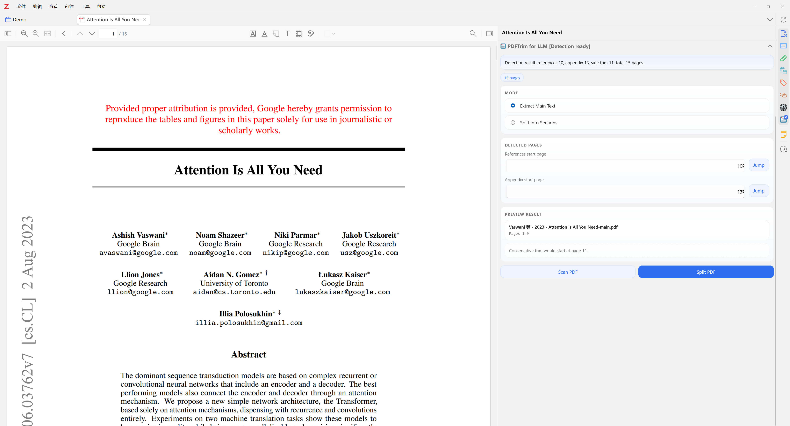
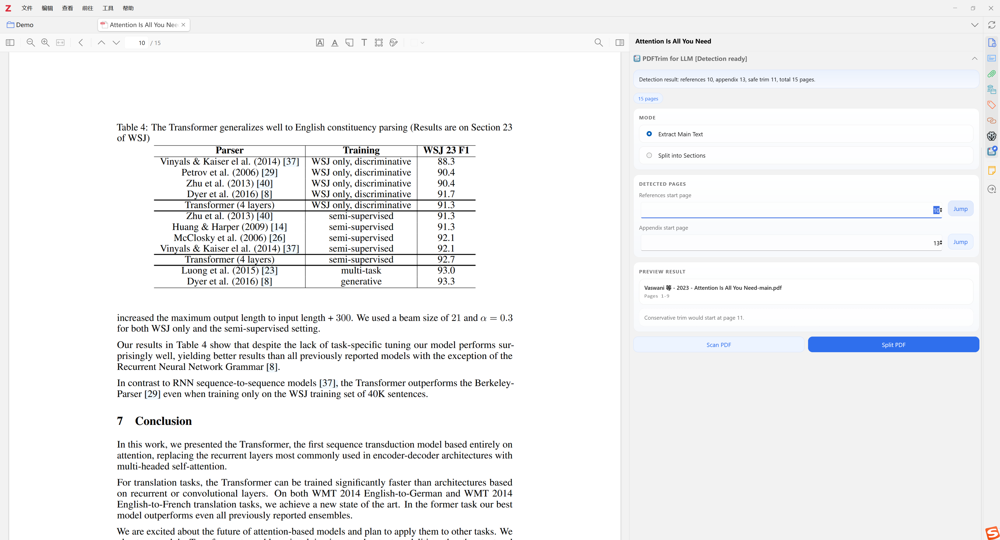
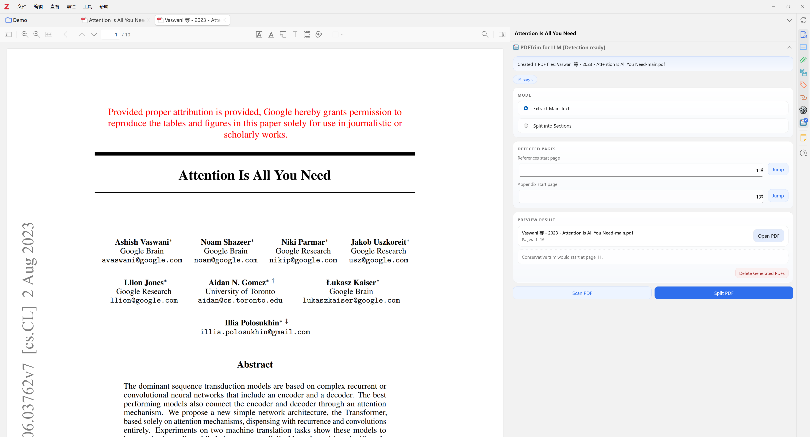
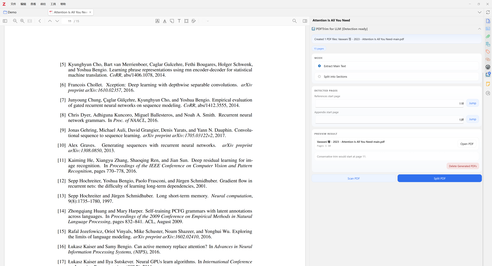

<div align="center">
  
  <h1>PDFTrim for LLM</h1>
  <p><strong>Trim the back matter before it eats your context window.</strong></p>
  <p>Clean the paper. Keep the argument. Save the context window.</p>
  <p>
    <a href="README.md">English</a> |
    <a href="doc/README-zhCN.md">简体中文</a>
  </p>
</div>

<div align="center">

[](https://www.zotero.org/)
[](https://github.com/ShengjieJin/pdftrim-for-llm/releases)
[](LICENSE)

</div>

---

## 🔥 News

- `v0.1.0` First public release with Zotero 7/8 support, split/export workflow, sidebar actions, and one-click cleanup for generated PDFs.

## ✨ Motivation

Most papers are much longer than the part we actually want to hand to an LLM.

When we send a paper to an LLM, we usually want the core argument, method, experiment design, and takeaways. But the PDF often also contains long `References`, appendices, prompts, pseudocode, ablations, and implementation details. Those sections are valuable for close reading, but they can also eat a surprising amount of context window.

That creates a familiar workflow tax:

- more tokens spent on material you may not need right now
- more noise in summaries and extraction tasks
- less room left for the actual paper

`PDFTrim for LLM` was built for that exact moment inside Zotero: you are reading a paper, you want a clean PDF for an LLM, and you do not want to manually export, crop, rename, and re-attach files every time.

This need was strongly inspired by [llm-for-zotero](https://github.com/yilewang/llm-for-zotero) and [Vibero](https://github.com/chenyu-xjtu/Vibero), which made the LLM-in-Zotero workflow feel very real and very useful. `PDFTrim for LLM` focuses on one small but painful bottleneck in that workflow: trimming token-heavy back matter before the paper goes into the model.

This project is built on top of [zotero-plugin-template](https://github.com/windingwind/zotero-plugin-template).

## 🧩 What It Does

- Detects where `References` starts.
- Infers where `Appendix` begins.
- Lets you review and edit the detected page numbers.
- Exports LLM-friendly PDFs next to the original file.
- Keeps the original PDF untouched.
- Attaches generated PDFs back to the same Zotero item.
- Lets you open or delete generated outputs from the sidebar.

## ⚠️ Detection Accuracy

The detected split positions are heuristic and are **not always exact**.

Before exporting, you should always:

- review the detected `References start page`
- review the detected `Appendix start page`
- use `Jump` to verify the pages manually
- adjust the page numbers if needed

The plugin is designed to reduce repetitive work, not to replace human confirmation.

## 🖼️ Screenshots


| Automatically detects the **References** and **Appendices** sections in a PDF. | Click `Jump` to navigate directly to the detected page. If the result is not accurate enough, you can also adjust it manually. |
| --- | --- |
|  |  |

| Click `Split PDF` to split the PDF in one step. Click `Open PDF` to open the generated split PDF directly. | After finishing your LLM workflow with the split main-content PDF, click `Delete Generated PDFs` to remove all generated PDF files in one click. |
| --- | --- |
|  |  |


## 📦 Installation

1. Download the latest `.xpi` from [GitHub Releases](https://github.com/ShengjieJin/pdftrim-for-llm/releases).
2. Open Zotero.
3. Go to `Tools -> Plugins`.
4. Drag the `.xpi` file into the Plugins window.
5. Restart Zotero if needed.

The release asset is expected to look like:

```text
pdf-trim-for-llm.xpi
```

## 🚀 Usage

1. Open a PDF in the Zotero reader.
2. Open `PDFTrim for LLM` in the right sidebar.
3. Wait for automatic detection.
4. Review:
   - `References start page`
   - `Appendix start page`
5. Use `Jump` to confirm the detected pages.
6. Adjust the page numbers if needed.
7. Choose a mode:
   - `Extract Main Text`
   - `Split into Sections`
8. Click `Split PDF`.

Generated PDFs are saved next to the source PDF and attached to the same Zotero item.

## 📄 Output

Given:

```text
paper.pdf
```

`Extract Main Text` creates:

```text
paper-main.pdf
```

`Split into Sections` creates:

```text
paper-main.pdf
paper-reference.pdf
paper-appendix.pdf
```

The source PDF is never modified.

## 🛠️ Development

Requirements:

- Node.js LTS
- Git
- Zotero 7 or Zotero 8

Start development:

```bash
npm install
npm start
```

Production build:

```bash
npm run build
```

Build outputs are generated in:

```text
.scaffold/build/
```

## 🧱 Repository Setup

This repository is already configured for:

- GitHub Releases
- `update.json` / `update-beta.json`
- Zotero `.xpi` packaging

If you later change the repository name, remember to update:

- [`package.json`](package.json)
- [`zotero-plugin.config.ts`](zotero-plugin.config.ts)

## ⚖️ License

This project is released under `AGPL-3.0-or-later`.

## 🙏 Acknowledgements

- [llm-for-zotero](https://github.com/yilewang/llm-for-zotero)
- [Vibero](https://github.com/chenyu-xjtu/Vibero)
- [zotero-plugin-template](https://github.com/windingwind/zotero-plugin-template)

